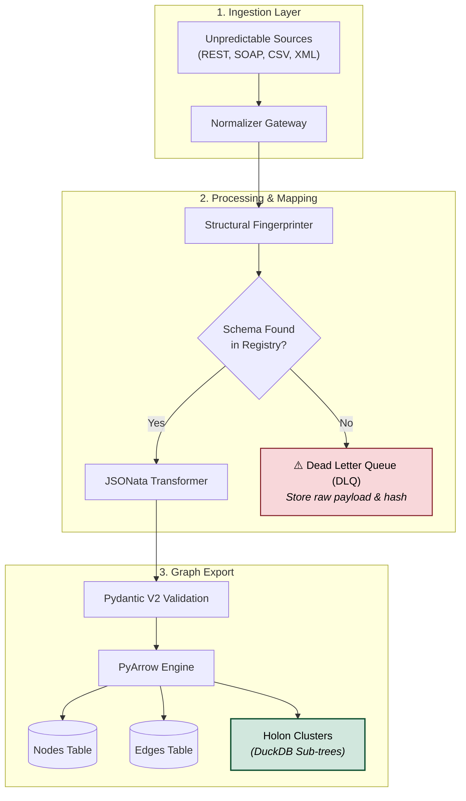

🔷 HolonIngest
> \*\*Zero-Code Dynamic Ingestion Engine for Holonic Knowledge Graphs.\*\*  
> Convert any heterogeneous payload (XML, CSV, JSON, Webhooks) into zero-copy PyArrow graph structures using structural fingerprinting and JSONata.

[](https://www.python.org/)
[](https://fastapi.tiangolo.com)
[](https://arrow.apache.org/)
[](https://opensource.org/licenses/MIT)
---
🚨 **The Problem**

Traditional ETL pipelines break when new API sources change their JSON schemas or send raw XML/CSV. Re-deploying parsers for every new IoT sensor, contract format, or HR system creates engineering debt and bloats your graph database with duplicate nodes.

💡 **The Solution**

**HolonIngest** sits between your raw data sources and your Graph AI/Workers:
**Normalizes** raw bytes (JSON, XML, CSV) on the fly.
**Fingerprints** payload topology using Structural Hashing (SHA256).
**Transforms** data using dynamic JSONata rules (no code deploy needed).
**Outputs** PyArrow Node/Edge tables pre-clustered for Holonic Graphs ($O(1)$ sub-tree grouping).

---

🚀 **Quickstart (30 Seconds)**
```bash
pip install holoningest
holoningest-server --port 8000

```
Send any payload:
```bash
curl -X POST "http://localhost:8000/api/v1/ingest" \\
     -H "Content-Type: application/xml" \\
     -d '<sensor><id>S-101</id><val>42.1</val></sensor>'

```
If the payload layout is unknown, HolonIngest sends it to the Dead Letter Queue (DLQ) with its structural hash:
```json
{
  "status": "DLQ\_UNRECOGNIZED\_SCHEMA",
  "fingerprint": "a1b2c3d4e5..."
}

```
Add a JSONata rule to the registry for that hash, and you're live. No restarts required.
---
📊 Architecture & Benchmarks

Latency: < 8ms per request (FastAPI + Pydantic V2 Rust Core)
Memory: Zero-copy transfer to Polars / DuckDB / Kuzu Graph DB via PyArrow
```
